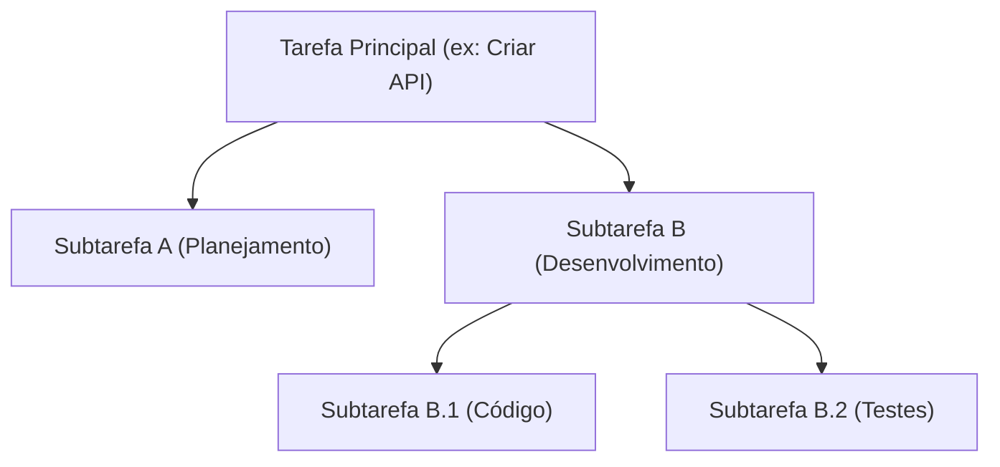

# Architecture Decision Record (ADR)

---

# ADR-004: Orquestrador Hierárquico de Subagentes e Subtarefas

## Status

[x] Aceita
[ ] Proposta
[ ] Rejeitada
[ ] Obsoleta

## Data

2026-07-20

## Contexto

O motor de orquestração original da **Engineering Platform** executava uma pipeline estática e sequencial (`Planner -> Architect -> Developer -> Reviewer -> QA -> DevOps -> Documentation`). Embora simples, essa abordagem linear falhava em:
1. Decompor tarefas complexas (ex: "Implementar Autenticação de dois fatores") em atividades granulares isoladas.
2. Permitir que agentes especialistas invoquem subagentes dinamicamente para focar em contextos menores (como documentar ou auditar segurança de uma única função).
3. Propagar artefatos de entrada e saída dinamicamente de forma hierárquica.

### Problema
Limitação na flexibilidade de orquestração e na qualidade de geração dos agentes devido à falta de isolamento de contexto e decomposição de tarefas.

### Restrições
- Compatibilidade reversa: a execução linear sequencial clássica deve continuar funcionando.
- Desempenho: evitar sobrecarga excessiva de tokens e recursões infinitas.

---

## Decisão

Adotamos a especificação de uma arquitetura baseada em **Árvores de Tarefas (`TaskNode`)** e **Execução Recursiva**.

### Detalhes do Design:
1. **Estrutura de Nós (`TaskNode`):** Cada nó possui identificador, nome, status, agente atribuído, logs específicos, dicionário de artefatos de entrada/saída e um array opcional de nós filhos.
2. **Propagação de Contexto:** Artefatos gerados por subtarefas anteriores são dinamicamente injetados no contexto compartilhado das subtarefas subsequentes do mesmo nível.
3. **Mecanismo de Execução Recursivo:** O método `executeHierarchicalTask` processa nós folha disparando o `AgentRuntime` específico e processa nós pais aguardando as subtarefas filhas sequencialmente, consolidando os outputs ao final.

---

## Consequências

### Positivas
- **Isolamento de Contexto:** Subagentes trabalham apenas com a parcela relevante do contexto, diminuindo alucinações.
- **Rastreabilidade Visual:** Possibilidade de renderizar árvores de execução dinamicamente no console.
- **Acumulação Automática:** Logs e artefatos de saída fluem e se consolidam organicamente para os nós pais da árvore.

### Negativas
- **Complexidade de Depuração:** Rastrear bugs em execuções com múltiplos níveis recursivos é mais complexo do que em fluxos lineares simples.

---

## Referências
- [capitulo-12-futuro-da-trilha.md](../interactive-tutorial/capitulo-12-futuro-da-trilha.md)
- [agent-runtime.ts](../mcp/src/core/agent-runtime.ts)

## Histórico

| Data | Autor | Mudança |
|------|-------|---------|
| 2026-07-20 | @engineering-platform | Criação do ADR documentando o orquestrador hierárquico |
