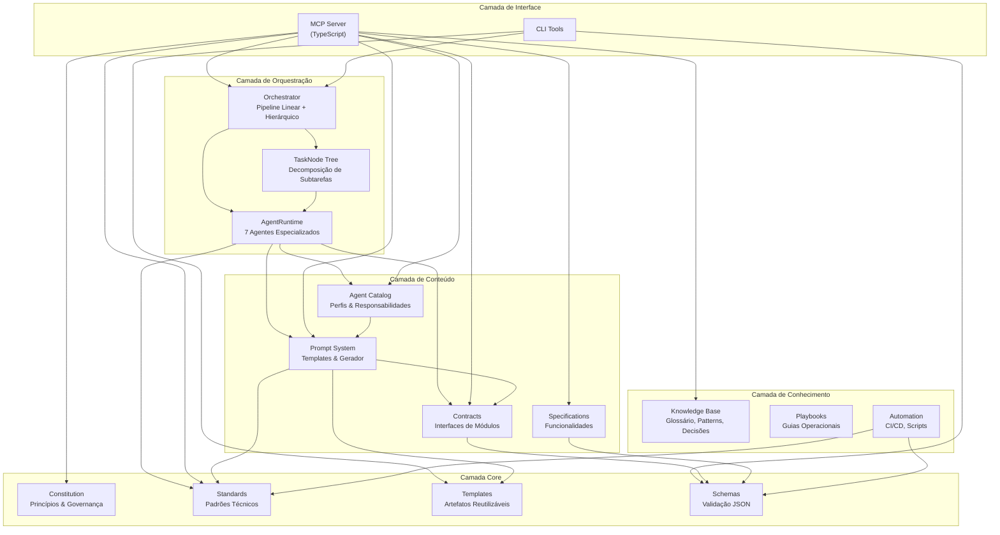
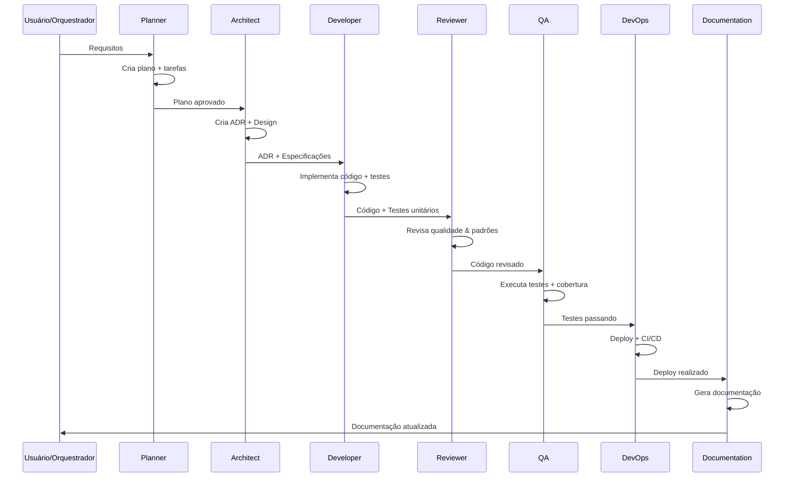
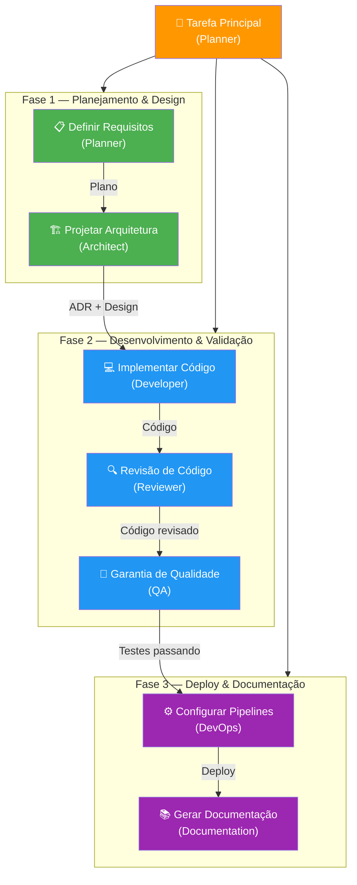
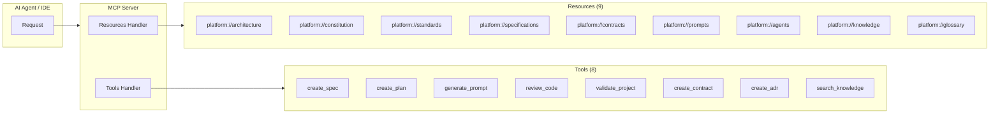
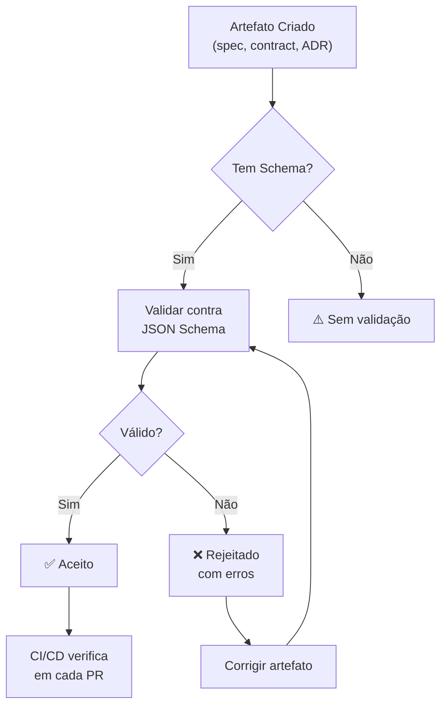

# Diagramas de Arquitetura

> Diagramas Mermaid da Engineering Platform.

## Arquitetura Geral

## Fluxo de Desenvolvimento

## Pipeline Linear de Agentes

## Orquestração Hierárquica de Subagentes

## Estrutura do MCP Server

## Fluxo de Validação de Artefatos

