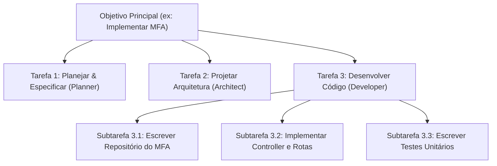

# Capítulo 12: Temas Para o Futuro da Trilha
> **Subtarefas, Subagentes, Engenharia de Contexto e Agentes Nativos (Modelos Raiz)**

---

## 🚀 Introdução

Bem-vindo ao **Capítulo 12: Temas Para o Futuro da Trilha**. A partir deste ponto da jornada, após termos consolidado a fundação da nossa **Engineering Platform** (com Constitution, Standards, Contracts e um MCP Server funcional), estamos prontos para subir o nível de abstração.

Deixamos para trás os prompts simples e estáticos e entramos na era da **autonomia agentic**. Este capítulo explora os pilares que permitirão à plataforma decolar: a decomposição em subtarefas, a orquestração de subagentes, a engenharia avançada de contexto e a construção de agentes especializados utilizando modelos nativos (raiz) de IA, superando os limites das ferramentas prontas de mercado.

---

## 🎯 1. Decomposição em Subtarefas

Um dos maiores desafios de IAs ao lidar com grandes codebases é o **esvaziamento de foco** e a perda de contexto em tarefas muito longas. A solução de engenharia para isso é a **decomposição granular de escopo**.



### Boas Práticas para Subtarefas:
* **Independência (Decoupling):** Cada subtarefa deve, Idealmente, ter entradas e saídas bem definidas através de **contratos de interface**.
* **Validação Rápida:** O sucesso de uma subtarefa deve ser testável isoladamente antes de integrar à tarefa pai (ex: rodar a suíte de testes apenas daquele módulo).
* **Rastreabilidade (State Tracking):** Uso de um arquivo dinâmico como o `.context/task.md` para monitorar quais subtarefas estão pendentes (`[ ]`), em progresso (`[/]`) ou concluídas (`[x]`).

---

## 🤖 2. Orquestração de Subagentes (Parent-Child)

Em vez de termos um único agente genérico tentando fazer todo o trabalho, a arquitetura de **Subagentes** adota um modelo de **Delegação Hierárquica**. Um agente principal (*Parent Agent*) atua como gerente, dividindo a tarefa em partes menores e disparando múltiplos agentes especialistas (*Child Agents*) em paralelo ou em sequência.

```text
       ┌──────────────────────┐
       │   Agente Principal   │ <─── Recebe o Objetivo Geral
       └──────────┬───────────┘
                  │
        ┌─────────┼─────────┐  (Delega subtarefas específicas)
        ▼         ▼         ▼
    ┌───────┐ ┌───────┐ ┌───────┐
    │ Sub-A │ │ Sub-B │ │ Sub-C │ <─── Executam de forma focada e isolada
    └───────┘ └───────┘ └───────┘
```

### Vantagens do Padrão de Subagentes:
1. **Limitação de Contexto:** Cada subagente recebe apenas a documentação e os arquivos necessários para a sua subtarefa específica, economizando tokens e evitando alucinações.
2. **Especialização de System Prompts:** O subagente de segurança só se preocupa com análise de vulnerabilidades, enquanto o de documentação foca em clareza textual.
3. **Loop de Correção Automatizado:** O agente pai pode analisar a saída de um subagente de código e, se encontrar erros de tipagem, disparar um subagente corretor de forma autônoma.

---

## 🧠 3. Engenharia de Contexto (Context Engineering)

A **Engenharia de Contexto** vai muito além de "escrever um bom prompt". Trata-se de como organizamos, filtramos e injetamos informações dinamicamente na janela de contexto do modelo.

Na nossa **Engineering Platform**, implementamos isso através de:
* **Single Source of Truth:** Centralização das regras de código em `standards/` e diretrizes em `constitution/`.
* **Dynamic Hydration:** O servidor MCP lê automaticamente os contratos do módulo em `contracts/` e os injeta nas instruções do agente que está desenvolvendo aquele código específico.
* **Semantic Search:** Uso de ferramentas como `search_knowledge` para buscar playbooks relevantes baseado no objetivo da tarefa, trazendo apenas o conhecimento necessário para o prompt.

---

## 💎 4. Agentes Customizados com Modelos Raiz (Nativos)

As extensões de IDE tradicionais (como Cloud Code, Copilot, Codex) são excelentes para autocompletar código ou responder dúvidas pontuais. No entanto, para criar fluxos de engenharia verdadeiramente autônomos, precisamos de **agentes nativos** que se conectem diretamente às APIs dos provedores de LLM de forma estruturada.

Ao interagir diretamente com um **Modelo Raiz** (por exemplo, a API do Gemini Pro ou Gemini Flash), ganhamos acesso a recursos avançados:
1. **System Instructions rígidas:** Para garantir que a IA nunca saia de sua persona ou viole as diretrizes da Constituição.
2. **Structured Outputs (JSON Schema):** Forçar o modelo a responder em formatos estritos para facilitar o parse automatizado.
3. **Function Calling nativo / MCP:** Conectar o modelo diretamente às nossas ferramentas de CLI (como criar ADRs, validar contratos e rodar testes) sem depender do interpretador da IDE.

### Exemplo Prático: Executando um Agente Nativo via MCP

Abaixo, um esboço de como nossa plataforma instancia um agente nativo que utiliza ferramentas MCP para criar arquivos e documentação de forma autônoma:

```typescript
import { GoogleGenAI } from "@google/genai"; // Utilizando o SDK nativo do Gemini
import { Client } from "@modelcontextprotocol/sdk/client/index.js";

async function runCustomAgent(requirements: string) {
  const ai = new GoogleGenAI({ apiKey: process.env.GEMINI_API_KEY });
  
  // O Agente recebe regras estritas como instruções de sistema
  const response = await ai.models.generateContent({
    model: 'gemini-2.5-pro',
    contents: `Desenvolva a especificação da feature: ${requirements}`,
    config: {
      systemInstruction: "Você é o Planner Agent da Engineering Platform. Você deve usar a ferramenta create_spec para registrar a especificação.",
      // Passando as ferramentas MCP registradas para Function Calling nativo
      tools: [{
        functionDeclarations: [
          {
            name: "create_spec",
            description: "Cria uma nova especificação física no repositório",
            parameters: {
              type: "OBJECT",
              properties: {
                name: { type: "STRING" },
                description: { type: "STRING" }
              },
              required: ["name"]
            }
          }
        ]
      }]
    }
  });

  console.log("Ações sugeridas pelo agente nativo:", response.functionCalls);
}
```

---

## 📈 Conclusão & Próximos Passos

O futuro da engenharia de software é a simbiose entre desenvolvedores humanos e ecossistemas de agentes autônomos. Com este capítulo estruturado, estamos prontos para:
- Projetar pipelines multiagentes mais complexos.
- Criar agentes que geram seus próprios subagentes para resolver bugs complexos.
- Evoluir nossa base de playbooks para enriquecer o contexto de cada execução.

---

> [!TIP]
> **Participe da Discussão!**
> Deixe nos comentários da trilha ou no nosso repositório de playbooks quais novos subagentes você acredita serem cruciais para o nosso fluxo de desenvolvimento daqui para frente. A evolução do ecossistema depende das nossas ideias colocadas em prática!
